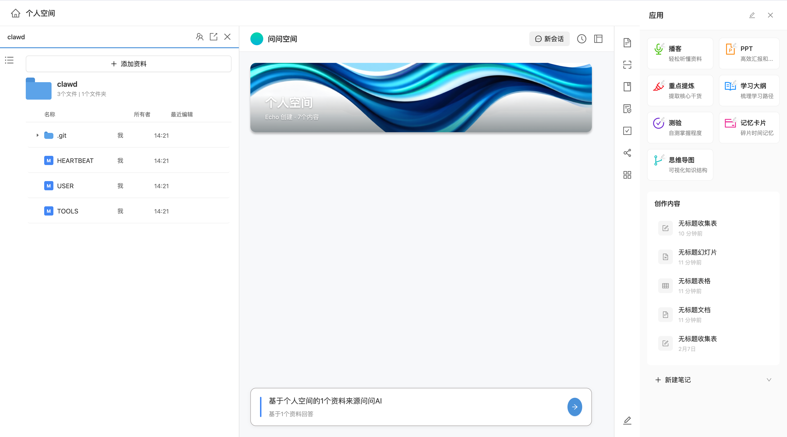

# 工作区 UI 



基于 React 19 + Ant Design 6 + TypeScript 构建的腾讯文档风格 UI 界面。

## 功能特性

- 📁 **文件管理面板** - 支持收起/展开状态切换，平滑动画过渡
- 🌲 **目录树导航** - 鼠标悬停显示，支持多级目录导航
- 👥 **成员管理抽屉** - 从侧边栏边界滑入，支持权限设置
- 📄 **文档详情视图** - 点击文档在当前页面动画展开
- 🎨 **个人空间卡片** - 支持自定义背景图片
- 💬 **AI 问答输入框** - 底部固定的问答入口
- 📌 **置顶功能** - 三栏布局：资料面板 + 文档编辑 + 问问空间
- 🔐 **权限管理** - 下拉菜单选择权限（仅我可查看/指定人/所有人可查看/所有人可编辑）
- ➕ **添加成员弹窗** - 选择协作人添加到文件夹

## 技术栈

- **React 19** - 前端框架
- **TypeScript** - 类型安全
- **Ant Design 6** - UI 组件库
- **Vite** - 构建工具
- **Less** - CSS 预处理器
- **Zustand** - 状态管理
- **React Router 6** - 路由管理

## 项目结构

```
src/
├── components/          # 公共组件
│   ├── AddFileModal/   # 添加资料弹窗
│   ├── AddMemberModal/ # 添加成员弹窗
│   ├── FileList/       # 文件列表组件
│   ├── FolderIcon/     # 文件夹图标组件
│   ├── MemberManageDrawer/  # 成员管理抽屉
│   └── RightContent/   # 右侧内容区
├── layouts/            # 布局组件
│   └── MainLayout/     # 主布局
├── pages/              # 页面组件
│   ├── HomePage/       # 首页（文件管理）
│   └── DocumentEditPage/  # 文档编辑页
├── store/              # 状态管理
├── styles/             # 全局样式
├── types/              # TypeScript 类型定义
├── App.tsx             # 应用入口
└── main.tsx            # 主入口文件
```

## 快速开始

### 安装依赖

```bash
npm install
```

### 启动开发服务器

```bash
npm run dev
```

### 构建生产版本

```bash
npm run build
```

### 预览生产版本

```bash
npm run preview
```

## 页面交互说明

### 首页文件管理

1. **收起状态** - 显示"资料"标题和文件夹列表
2. **展开状态** - 点击文件夹后展开，显示文件列表和详情
3. **目录树** - 鼠标悬停左侧列表图标显示，点击返回收起状态
4. **成员管理** - 点击协作图标，抽屉从侧边栏边界滑入

### 置顶功能（页面7）

- 点击"置顶"图标进入置顶模式
- 三栏布局：左侧资料面板（目录树固定显示）+ 中间文档编辑面板 + 右侧问问空间
- 点击目录树中的文档可切换显示内容

### 成员管理流程（页面6-11）

1. 点击协作图标打开成员管理抽屉
2. 点击权限下拉选择权限级别
3. 点击"添加成员"打开选择协作人弹窗
4. 选择好友后确认，成员列表更新

### 文档查看

- 点击文件夹进入子目录
- 点击文档在当前页面展开详情视图
- 点击返回按钮回到文件列表

## 自定义配置

### 修改个人空间背景图片

将图片放入 `public/images/` 目录，然后修改 `src/components/RightContent/index.module.less` 中的 `.heroCard` 样式：

```less
.heroCard {
  background-image: url('/images/your-image.png');
}
```

## License

MIT
